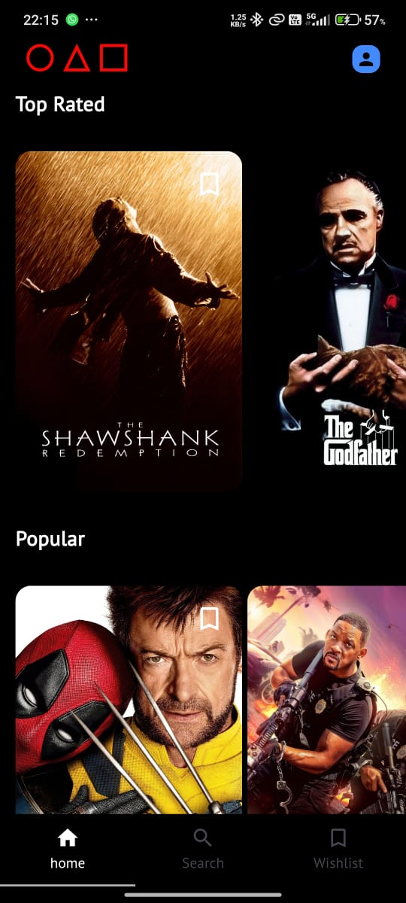
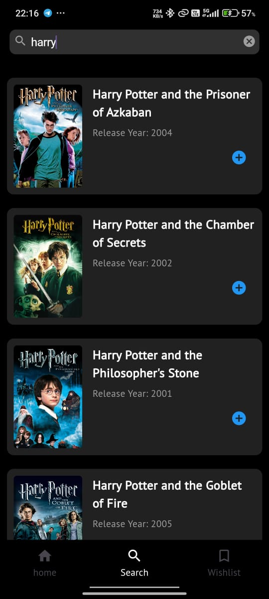

# Movie Wishlist App

A Flutter application for searching movies and adding them to a wishlist. The app fetches movie data from an external API, displays search results, and allows users to view detailed information about each movie. Users can add or remove movies from their wishlist, and the wishlist is persisted using Hive for local storage.

## Features

- Search for movies using the search bar.
- Display movie details including title, release date, genres, and overview.
- Add or remove movies from the wishlist.
- Persistent wishlist storage using Hive.
- Custom animations for page transitions.

## Screenshots

  
  
  
  

